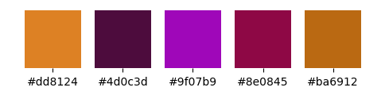

## Credit Card Churn

The following machine learning model was developed to predict the likelihood of credit card churn, using existing client data.

The entire project was developed following some predetermined guidelines, listed below:

1. **Data Acquisition:** It was from two sources, but with datasets of the same size;
2. **Extract, Transform and Load (ETL):** Data preprocessing, cleaning, rescaling, pattern recognition;
3. **Relevant Variables:** Sex, gender, salary, bank score;
4. **Data Analysis:** Type of data (categorical or numeric), statistical analysis, outliers, normalization;
5. **Machine Learning Models:** Clustering, classification, regression, decision trees.

This guideline is important to the data treatment pipeline. In this case, the focus isn't on solving the churn problem, but on identifying possible clients who might churn their credit cards.

## Color Palette
Below are the colors selected for this project:



## 1 - Data acquisition:
Data acquisition was from Kaggle, using the following link:
https://www.kaggle.com/datasets/anandshaw2001/customer-churn-dataset

All used data was saved at the same path on the computer, which was at `(../Dados/)`

## 2 - Extract, Transform and Load:
To import the data, I used the `pandas` library with this simple structure of it: `.read_csv('path')`.
The dataset was divided into three files to demonstrate how to concatenate them again.

So, here is how the code looks:

```
#Reading the CSV archives
df1 = pd.read_csv('../Dados/Customer-Churn-Records1.csv', delimiter=";")
df2 = pd.read_csv('../Dados/Customer-Churn-Records2.csv', delimiter=";")
df3 = pd.read_csv('../Dados/Customer-Churn-Records3.csv', delimiter=";")
```
Concatenating and inspecting:
```
df = pd.concat([df1, df2, df3], axis=0)
df
```

## 3 - Relevant Variables:
Zeroing the main diagonal

Looking for the maximum values in the matrix by the descending sort

Looking for the minimun values in the matrix by the descending sort

## 4 - Data Analysis:
corrmatrix

Viewing it through a heatmap

Analysing the relationship between Age and Exited

Criando um gráfico do tipo "Scatter" para observar a proporção entre idade e salários de homens e mulheres

## 5 - Machine Learning Models:
**Criando o Modelo**
No caso, são necessárias 4 variáveis no modelo. 2 de treino e 2 de teste:
Isso acontece porque elas são mapeadas em um plano cartesiano, sendo de treino ou teste;
Daí um ponto para treino no plano cartesiano tem uma posição em X e outra em y e outro ponto, para teste, tem uma posição em X e outra posição em y. Formando os 4 pontos necessários:
X_train, y_train, X_test, y_test

## Tools and Libraries Utilized:
**Tools:** Python, Jupyter, Anaconda, Git and GitHub.
**Libraries:** Numpy, Pandas, matplotlib, seaborn, sklearn and tensorflow.

## Contact me
Linkedin: https://www.linkedin.com/in/jose-valdeir-paiva-araujo/

Github: https://github.com/Rumanns

Gmail: valdeircomv@gmail.com


